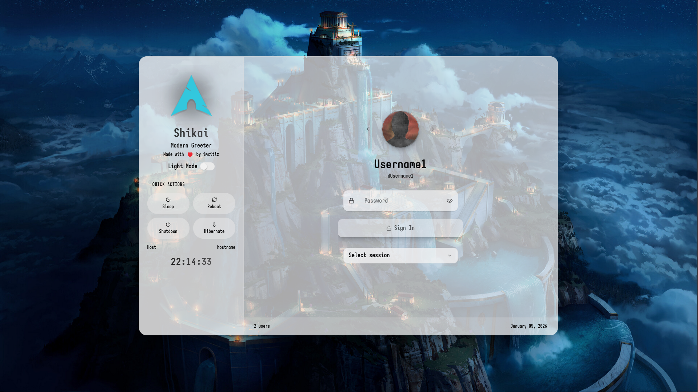
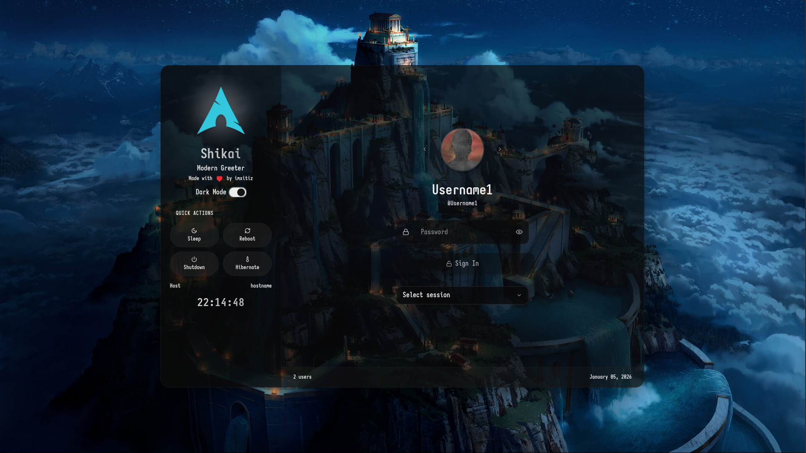
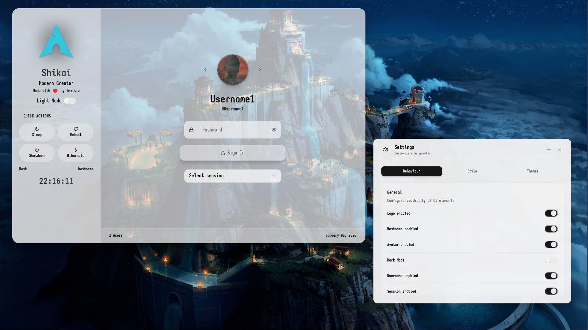
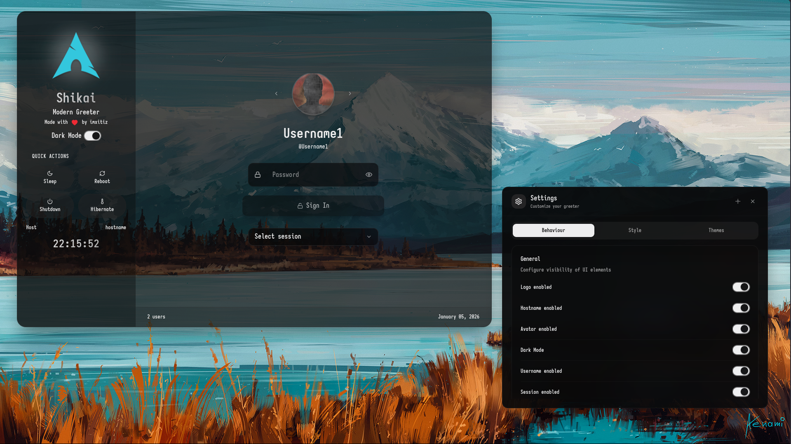

<h1 align="center">Shikai</h1>

    

Modern LightDM WebKit2 Theme

<h2 align="center">Index</h2>

Click to Expand

  [Description][description]  
  [Features][features]  
  [Live Demo][livedemo]  
  [Screenshots][screenshots]  
  [Install][install]  
  [Uninstall][uninstall]  
  [Update][update]  
  [Configuration][configuration]  
  [Working Environment][working-environment]  
  [Dependencies][dependencies]  
  [Contributions][contributions]  
  [Translations][translations]  
  [Discussions][discussions]  
  [Notes & Troubleshooting][notes]  
  [License][license]  
  [Code of Conduct][coc]  
  [Authors][author]

<h2 align="center">Description [<a href="#index">↑</a>]</h2>

    Sleek, performance-focused LightDM WebKit2 theme with a modern UI.  
    <strong>v2.0.0</strong> is a complete rewrite: migrated to TypeScript, Zustand, Vite/Bun, and Tailwind CSS for better maintainability and speed.

<small>Originally created by <a href="https://github.com/TheWisker/Shikai">TheWisker</a>. Forked, rewritten, and maintained by imxitiz since v2.0.0.</small>

<h2 align="center">Features [<a href="#index">↑</a>]</h2>

v2.0.0 introduces a refreshed modern UI while retaining core functionality:

- **Draggable windows** for flexible positioning
- **Multi-monitor support** with synchronized backgrounds
- **Multi-language support** (UI localization)
- Custom **time and date formats**
- **Sub-themes** for saving configurations
- **Background shuffle** on click
- **Sleek animations** and hover effects
- Graphical **style** and **behavior** configuration (on-theme editor)
- **Custom backgrounds** via `web-greeter.yml`
- **Idle auto-hide** (configurable timeout)
- **Default user/session** selection
- **Custom user images** via `.face` files
- **Accessibility improvements** (ARIA labels, better contrast)

**New in v2.0.0**: Type-safe code, faster builds, immutable state management, and responsive Tailwind styling.

<h2 align="center">Live Demo [<a href="#index">↑</a>]</h2>

    <a href="https://thewisker.github.io/Shikai">Try the Original Demo</a> (v1.x – shows classic UI)

> [!TIP]  
> Demo password: `password`

> [!NOTE]  
> This demo uses the original v1.x version (classic mode). v2.0.0 features a modern UI with Tailwind CSS – install to see the full experience! Wallpapers may not fit all aspect ratios; customize after install.

<h2 align="center">Screenshots [<a href="#index">↑</a>]</h2>

    
    
     
    
    

<h2 align="center">Install [<a href="#index">↑</a>]</h2>

Choose your method – all require the **General** steps afterward.

### General

1. Edit `/etc/lightdm/lightdm.conf`:  
   Under `[Seat:*]`, set `greeter-session=web-greeter`.
2. Edit `/etc/lightdm/web-greeter.yml`:  
   Under `branding`, set `theme: shikai`.
3. Optionally configure as in [Configuration][configuration].

> [!WARNING]  
> Supports only [WebGreeter](https://github.com/JezerM/web-greeter), [NodyGreeter](https://github.com/JezerM/nody-greeter), and [SeaGreeter](https://github.com/JezerM/sea-greeter). SeaGreeter is older – test compatibility.

### Script

1. Download/unpack a [release][releases].
2. Run `./scripts/install.sh`.

### Manual

1. Download/unpack a [release][releases].
2. In `dist/index.html` and `dist/monitor.html`, set `window.__is_debug = false;`.
3. Copy `dist/*` to `/usr/share/web-greeter/themes/shikai`.

<h2 align="center">Uninstall [<a href="#index">↑</a>]</h2>

### General

- Switch themes/greeters in config files (see Install > General).
- Remove `/usr/share/web-greeter/themes/shikai`.

<h2 align="center">Update [<a href="#index">↑</a>]</h2>

Install new version over old.  
> [!CAUTION]  
> **Delete localStorage** via on-theme config before updating to avoid errors from breaking changes.

<h2 align="center">Configuration [<a href="#index">↑</a>]</h2>

### On-Theme

Hover top-left for config button.  

- **Style**: Colors, fonts, etc.  
- **Behavior**: Idle timeout, defaults.  
- **Sub-themes**: Create/save custom sets.  
Saved on panel close/theme actions.

### Greeter (`/etc/lightdm/web-greeter.yml`)

| Key | Description | Recommended | Type |
|-----|-------------|-------------|------|
| `background_images_dir` | Wallpapers path | `/usr/share/web-greeter/themes/shikai/assets/media/wallpapers` | str |
| `logo_image` | Logos path | `/usr/share/web-greeter/themes/shikai/assets/media/logos` | str |
| `user_image` | Default avatar | `/usr/share/web-greeter/themes/shikai/assets/media/profile.png` | str |
| `theme` | Theme name | `shikai` | str |
| `default_user` | Pre-select user | (your username) | str |
| `default_session` | Pre-select session | (e.g., gnome) | str |
| `screensaver_timeout` | Idle blank time | 300 (seconds) | int |

### LightDM

Enable numlock: Install `numlockx`, add `greeter-setup-script=/usr/bin/numlockx on` to `/etc/lightdm/lightdm.conf`.

<h2 align="center">Working Environment [<a href="#index">↑</a>]</h2>

Requires Bun (preferred) or npm.  

- `bun install` (or `npm install`).  
Scripts:  
- `bun run dev` – Development build.  
- `bun run build` – Production build.  
- `bun run watch` – Watch mode.  
- `bun run server` – Local preview.

> [!WARNING]  
> Avoid `npm update` – it may break dependencies. Revert with repo's `package.json`.

<h2 align="center">Dependencies [<a href="#index">↑</a>]</h2>

- **Runtime**: LightDM + [WebGreeter](https://github.com/JezerM/web-greeter), [NodyGreeter](https://github.com/JezerM/nody-greeter), or [SeaGreeter](https://github.com/JezerM/sea-greeter).
- **Buildtime**: See [package.json][package].

<h2 align="center">Contributions [<a href="#index">↑</a>]</h2>

All contributions welcome! See [CONTRIBUTING.md][contributing].  
Contributors: [CONTRIBUTORS.md][contributors].

<h2 align="center">Translations [<a href="#index">↑</a>]</h2>

Help localize! See [CONTRIBUTING.md][lang-contributing].  
Translators: [credits.js][translators].

<h2 align="center">Discussions [<a href="#index">↑</a>]</h2>

- [Ideas](https://github.com/imxitiz/Shikai-webgreeter-lightdm/discussions/categories/ideas)  
- [Questions](https://github.com/imxitiz/Shikai-webgreeter-lightdm/discussions/categories/q-a)  
- [Screenshots](https://github.com/imxitiz/Shikai-webgreeter-lightdm/discussions/categories/show-and-tell)

<h2 align="center">Notes & Troubleshooting [<a href="#index">↑</a>]</h2>

### Notes

- Add distro logos/languages/wallpapers: Submit [pull request][pull-request]!
- Non-standard images may cause issues.

### Troubleshooting

- **Image not loading**: Set read/execute permissions for `lightdm` user on `.face` file/folder.
- **Settings missing after update**: Delete localStorage or add missing keys via dev console.
- **Errors**: Enable `detect_theme_errors: true` in `web-greeter.yml`.

<h2 align="center">License [<a href="#index">↑</a>]</h2>

GPLv3. See [LICENSE][license].

<h2 align="center">Code of Conduct [<a href="#index">↑</a>]</h2>

Follow our [Contributor Covenant][coc].

<h2 align="center">Authors [<a href="#index">↑</a>]</h2>

    

<h4 align="center">imxitiz — Maintainer since v2.0.0</h4>

<small>Original by <a href="https://github.com/TheWisker">TheWisker</a>.</small>

[description]: #description-
[features]: #features-
[livedemo]: #live-demo-
[screenshots]: #screenshots-
[install]: #install-
[uninstall]: #uninstall-
[update]: #update-
[configuration]: #configuration-
[working-environment]: #working-environment-
[dependencies]: #dependencies-
[contributions]: #contributions-
[translations]: #translations-
[discussions]: #discussions-
[notes]: #notes--troubleshooting-
[license]: #license-
[coc]: #code-of-conduct-
[author]: #authors-

[releases]: https://github.com/imxitiz/Shikai-webgreeter-lightdm/releases/
[contributing]: ./CONTRIBUTING.md
[contributors]: ./CONTRIBUTORS.md
[lang-contributing]: ./src/lang/CONTRIBUTING.md
[translators]: ./src/lang/credits.js
[pull-request]: https://github.com/imxitiz/Shikai-webgreeter-lightdm/pulls
[package]: ./package.json